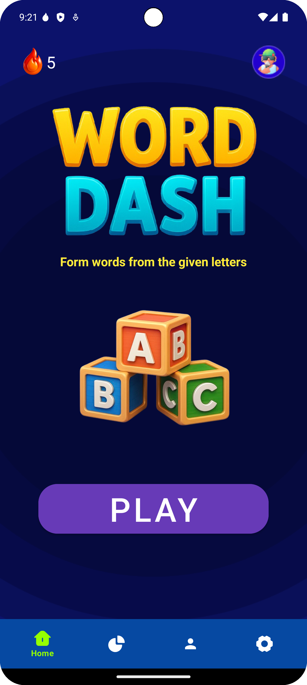
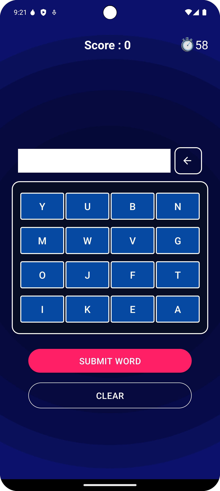
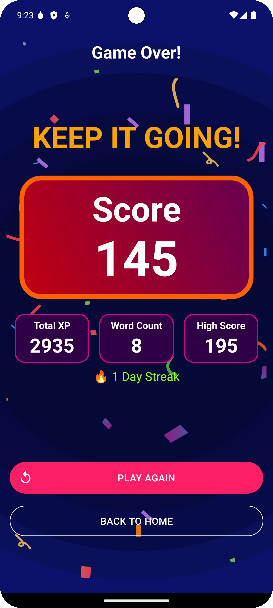
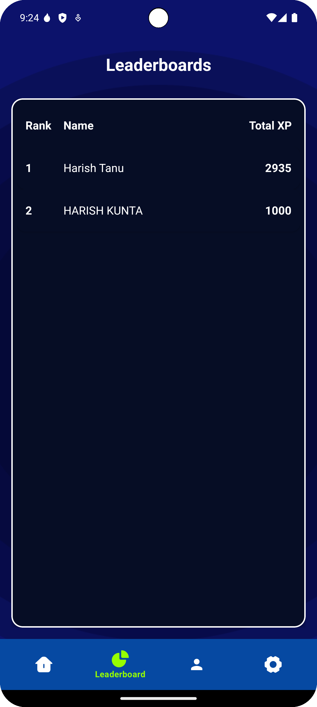

# Cognify 🧠

Cognify is an open-source Android game that delivers bite-sized brain workouts every day. Built entirely in Java, it combines slick animations with Firebase services to keep your progress safe across devices.

[](https://play.google.com/store/apps/details?id=com.gigamind.cognify)

## Table of Contents
- [Features](#features)
- [Screenshots](#screenshots)
- [Getting Started](#getting-started)
- [Building from Source](#building-from-source)
- [Gameplay](#gameplay)
- [XP, Streaks & Leaderboards](#xp-streaks--leaderboards)
- [Score Calculation](#score-calculation)
- [Contributing](#contributing)

## Features
- \U0001F389 **Animated Onboarding** with sound and confetti
- \U0001F525 **Daily Challenges** in *Word Dash* and *Quick Math*
- \U0001F3C6 **Global Leaderboards** powered by Firebase
- \U0001F4A5 **Streak Tracking** with optional notifications
- \U0001F4AA **Guest Mode** – play instantly and sync later
- \U0001F9D1‍\U0001F4BB **Custom Avatars** and a Trophy Room
- \U0001F512 **Firebase App Check** for secure backend access
- Accessibility toggles for sound, haptics, and motion

## Screenshots
<p align="center">
  
  
  
  
</p>

## Getting Started
1. Clone this repository.
2. Place your **google-services.json** inside the `app/` directory.
3. Build and install from Android Studio **or** run:
   ```bash
   ./gradlew assembleDebug
   ```

## Building from Source
The project uses Gradle with the Android Gradle Plugin. Android Studio Electric Eel or newer is recommended. `local.properties` must point to your Android SDK location.

## Gameplay
### Word Dash
Form as many valid words as you can from a 4×4 grid before time runs out. Longer and trickier words earn exponentially more points.

### Quick Math
Answer as many arithmetic questions as possible in 60 seconds. Questions scale in difficulty and faster responses are rewarded with higher scores.

## XP, Streaks & Leaderboards
Each completed game grants XP based on your performance. Keeping a daily streak adds extra XP and lets you climb the global leaderboard. XP thresholds unlock badges from **Rookie** all the way up to **Legend**.

## Score Calculation
For a deep dive into how every point is awarded see [SCORING.md](SCORING.md).

## Contributing
Pull requests are welcome! Feel free to open issues or propose features that would make Cognify even better.
